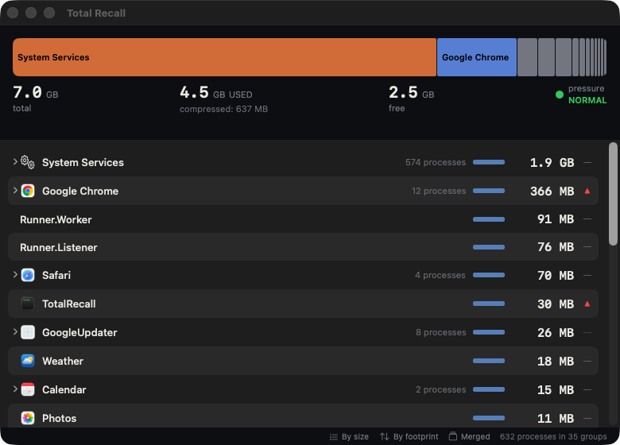

# Total Recall

A macOS menu bar app that provides intelligent, grouped views of memory (RAM) usage. Unlike Activity Monitor, Total Recall groups processes by logical application using built-in knowledge of how apps like Chrome, VS Code, Docker, Claude Code, and system services manage their process hierarchies.

## The one thing to know: blue is RAM, amber is not

The number Activity Monitor gives you is an app's *footprint* — what it is
charged for, not what it occupies. macOS compresses pages it thinks you are
done with and writes others out to swap, and on a loaded machine the gap
between the two runs to gigabytes. Total Recall's whole reason to exist is
showing you that gap, so it spends its entire palette on it — two colors, and
no others:

| | Means | Where it comes from |
|---|---|---|
| 🟦 **In RAM** | Pages really sitting in physical memory right now | `residentSize` |
| 🟧 **Compressed / swapped** | Memory macOS has squeezed out of physical RAM — compressed in place or written to disk | `physFootprint - residentSize` |

Nothing else in the app is colored, so there is no palette to memorize. The
Memory River names its two halves down the left gutter in those same two
colors, and carries a written key beneath the bar whenever you are not hovering
a segment; the detail panel repeats it against the actual numbers. A group with
a deep amber stub is not costing you RAM right now — but going back to it means
waiting on decompression or swap I/O, which is what "my machine has plenty of
free memory and still feels slow" usually turns out to be.

## Features

- **Smart process grouping**: Chrome processes grouped by profile, Electron apps by bundle, Claude Code by workspace, system daemons with human-readable explanations
- **Memory River**: proportional stacked bar across all your RAM — apps on the left, an "Other" segment for used memory no app claims, free space on the right. The bar splits at a midline: blue segment widths above it are resident memory, and below it each app hangs an amber stub for what has been compressed or swapped out. Because width is already resident memory, stub depth makes each rectangle's *area* the memory it holds — a deep stub is an app much larger than it looks, and two stubs of equal area hold equal memory wherever they sit in the bar. A left gutter names the two halves in their own colors; the line beneath the bar carries the key until you hover a segment, when it becomes that segment's readout
- **Memory composition bars**: per-process breakdown of resident (in RAM) vs compressed/swapped, in the same two colors, with both figures in the tooltip
- **VM region breakdown**: the Regions tab in the detail panel walks a single-process app's virtual address space and shows categories (`__TEXT`, Heap, Anonymous, Stack, File-backed) with virtual size and resident pages; system and other-user processes show a clear access-denied explanation
- **Per-group sparklines**: each group row charts its memory footprint over the last ~2 minutes, so a leak's slow ramp, a GC sawtooth, or a one-off step-change is recognizable by shape at a glance
- **Menu bar presence**: memory pressure indicator + used/total display, with compressed and swap totals in the dropdown
- **Trend indicators**: see which apps are growing or shrinking over time
- **Sort by footprint or resident**: understand total impact vs what's actually in RAM
- **Instance merging**: toggle between merged view (all Chrome instances as one) and separate view
- **Safe kill actions**: PID-verified termination with system process protection and audit logging
- **Working directory context**: see which directory Claude Code sessions are running in
- **Process identification**: resolves `node`, `python3`, volta shims to what they're actually running (TypeScript Server, Webpack, MCP Server, etc.)

## Screenshot



## Requirements

- macOS 26 (Tahoe) or later
- Xcode 17+ (for building from source)
- Apple Silicon or Intel Mac

## Installing

Download the latest `TotalRecall-<version>-arm64.dmg` from [Releases](https://github.com/alecf/totalrecall/releases/latest), open it, and drag **Total Recall** to Applications.

Total Recall is ad-hoc signed but **not notarized** (I don't have a paid Apple Developer account). The first time you launch it, macOS will show:

> *"Apple could not verify 'Total Recall.app' is free of malware..."*

To allow it:

1. Double-click the app → click **Done** on the warning.
2. Open **System Settings → Privacy & Security**.
3. Scroll to the security section — you'll see *"'Total Recall' was blocked..."* with an **Open Anyway** button.
4. Click **Open Anyway** and authenticate.
5. Launch the app again — you'll get one more confirmation dialog; click **Open Anyway**.

You only need to do this once. Alternatively, from Terminal:

```bash
xattr -d com.apple.quarantine "/Applications/Total Recall.app"
```

## Building

```bash
git clone https://github.com/alecf/totalrecall.git
cd totalrecall
swift build
swift run TotalRecall
```

## Running the diagnostic CLI

The diagnostic tool outputs the full classified process tree to the terminal:

```bash
swift run TotalRecallDiag
```

## Running tests

```bash
swift test
```

## Architecture

```
ProcessMonitor (actor, background thread)
  → SystemProbe (libproc/sysctl/Mach API wrappers)
  → ClassifierRegistry → ChromeClassifier, ElectronClassifier,
                          ClaudeCodeClassifier, SystemServicesClassifier,
                          GenericClassifier
  → Returns [ProcessGroup] + SystemMemoryInfo

AppState (@MainActor, @Observable)
  → Receives classified groups, computes trends
  → Drives SwiftUI views

Views (SwiftUI)
  → MenuBarExtra(.menu) — compact menu bar dropdown
  → Window — Memory River, group list, detail panel
```

### Tiered data collection

| Tier | API | Cost (886 PIDs) | Strategy |
|------|-----|-----------------|----------|
| 0 | `proc_listallpids` | 0.17ms | Every cycle |
| 1 | `proc_pid_rusage` | 2.6ms | Every cycle |
| 2 | `proc_pidinfo` + `proc_pidpath` | 2.8ms | Cached per PID |
| 3 | `KERN_PROCARGS2` | 9.2ms | Cached per PID |

Full collection takes ~15ms for 886 processes (0.3% of a 5-second interval).

### Memory model

- **Physical footprint** (`phys_footprint`): the primary metric, same as Activity Monitor's "Memory" column
- **Resident**: pages currently in physical RAM — drawn in blue everywhere, labelled "In RAM"
- **Non-resident**: compressed in-place or swapped to disk — drawn in amber everywhere, labelled "Compressed". macOS reports the two separately system-wide but not per process, so a per-process figure can only name one of them; it names the compressor because that is the half macOS reaches first, and because it is the word Activity Monitor uses for the same memory. The wording lives in `Theme.residentLabel` / `Theme.nonResidentLabel` so every view says it the same way
- **Shared memory**: deduplicated via RSHRD heuristic for group totals

## Project structure

```
TotalRecall/           — App source
  Models/              — ProcessSnapshot, ProcessGroup, SystemMemoryInfo
  DataLayer/           — SystemProbe, ProcessMonitor, RedactionFilter, ProcessActions
  Profiles/            — ProcessClassifier protocol + 5 classifiers
  Theme/               — Colors, typography, spacing
  Views/               — SwiftUI views
  Utilities/           — Formatting, diagnostics
TotalRecallDiag/       — CLI diagnostic tool
TotalRecallTests/      — Tests with synthetic fixtures
tools/                 — Benchmark scripts
docs/                  — PRD, research, plans
site/                  — Marketing website (React + Vite) + Sparkle appcast
```

## Auto-updates

Released builds use [Sparkle](https://sparkle-project.org/) to check for
new versions daily and offer them via the menu bar. The appcast feed
lives at <https://alecf.github.io/totalrecall/appcast.xml>; updates are
verified with EdDSA before installation. See
[docs/sparkle-setup.md](docs/sparkle-setup.md) for the one-time key
generation steps required before the first signed release.

## Contributing

This project is in early development. Issues and PRs welcome.

## License

MIT
